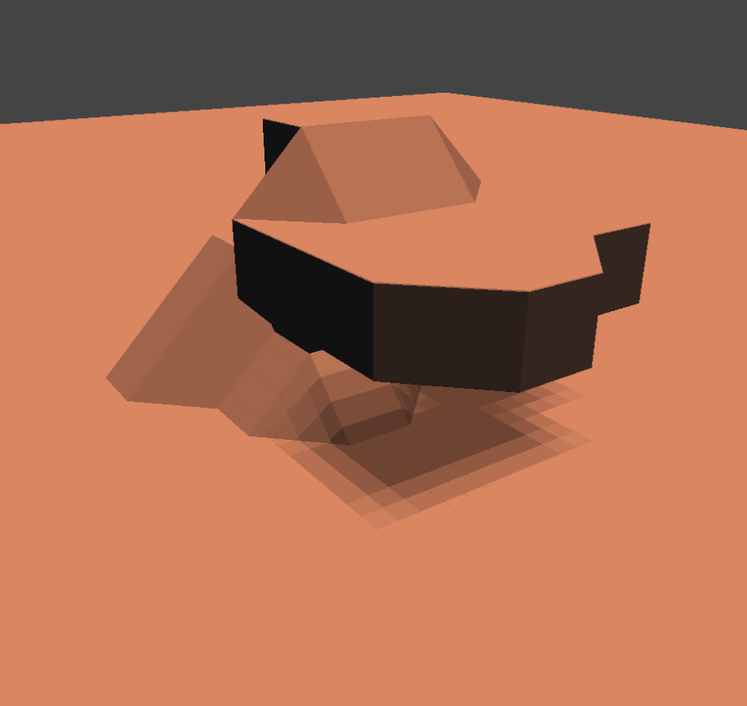

webgl-marchingcubes
===================

A WebGL implementation of the marching cubes algorithm for deformable terrain

Prerequisites
=============

If you don't already have a static file serving solution, you'll need [Node.js](http://nodejs.org/). You won't need to install any other packages, though.

Running the App
===============

First, host the files. You can do this using Node.js and `fileserver.js`, located in the root directory.

    > node fileserver.js
    
This will host the directory on `http://localhost:8888/index.html`. Navigate there to view the scene.

Controls
========

Use WASD to move the camera. Use the left mouse button and mouse pan to change the camera angle. Use Q to build a block and E to destroy one.

Alternate Terrain
=================

To generate the scene with flat terrain instead of Perlin noise, add a hash to the URL: `http://localhost:8888/index.html#flat`.

Screenshots
==========

The perlin noise generated terrain version

A simple demonstration of shadows and deformable terrain in the flat generation version.